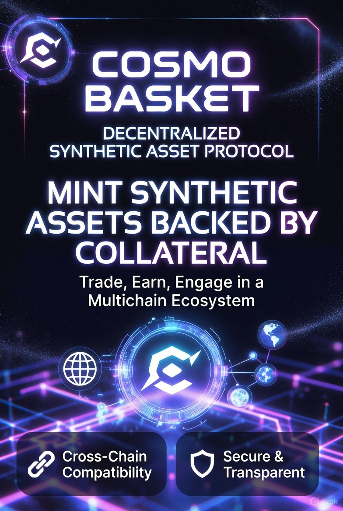

# CosmoBasket




A decentralized synthetic asset protocol that enables users to mint synthetic assets backed by collateral.

## Overview

CosmoBasket is a collateral-backed synthetic asset protocol built on Ethereum. Users can deposit supported collateral assets (like BTC, ETH) and mint synthetic assets (like sBTC, sETH, sSPY, sUSD) that track the value of real-world assets.

## Key Features

- **Collateral Management**: Deposit and withdraw multiple types of collateral assets
- **Synthetic Asset Minting**: Mint synthetic assets backed by your collateral
- **Debt Pool System**: Track user debt positions across the protocol
- **Liquidation Mechanism**: Maintain protocol health through liquidations of risky positions
- **Price Oracle Integration**: Real-time price feeds for accurate valuations

## Architecture

### Core Contracts

- **CollateralManager.sol**: Main contract for managing collateral deposits, withdrawals, minting, and liquidations
- **DebtPool.sol**: Tracks and manages user debt positions
- **PriceOracle.sol**: Provides price feeds for assets
- **SyntheticAsset/** (sBTC, sETH, sSPY, sUSD): ERC20 tokens representing synthetic assets

### Interfaces

- **IDebtPool.sol**: Interface for debt pool operations
- **IPriceOracle.sol**: Interface for price oracle queries
- **ISynAsset.sol**: Interface for synthetic asset operations

## Risk Parameters

| Parameter | Value | Description |
|-----------|-------|-------------|
| Health Factor | 300% | Target collateralization ratio |
| Mint Risk Ratio | 200% | Minimum ratio required to mint new assets |
| Liquidation Risk Ratio | 180% | Threshold for withdrawal restrictions |
| Liquidation Threshold | 150% | Position becomes eligible for liquidation |
| Liquidation Bonus | 5% | Reward for liquidators |

## Usage

### Depositing Collateral

```solidity
collateralManager.depositCollateral(assetAddress, amount);
```

Users must approve the CollateralManager contract to transfer their collateral tokens first.

### Minting Synthetic Assets

```solidity
collateralManager.mintSyntheticAsset(synAssetAddress, amount);
```

Requirements:
- Sufficient collateral deposited
- Position must maintain at least 200% collateralization ratio after minting
- Final health factor must remain above 180%

### Burning Synthetic Assets

```solidity
collateralManager.burnSyntheticAsset(synAssetAddress, amount);
```

Burns synthetic assets to reduce debt position.

### Withdrawing Collateral

```solidity
collateralManager.withdrawCollateral(assetAddress, amount);
```

Requirements:
- Sufficient collateral balance
- If debt exists, position must maintain at least 180% collateralization after withdrawal

### Liquidating Positions

```solidity
collateralManager.liquidate(userAddress, amountInUSD);
```

Liquidators can liquidate undercollateralized positions (below 150%) and receive a 5% bonus. Liquidations use sUSD to repay debt and distribute collateral proportionally.

## Security Features

- **ReentrancyGuard**: Protection against reentrancy attacks
- **SafeERC20**: Safe token transfer operations
- **Balance Validation**: Verifies actual token transfers match expected amounts
- **Health Factor Checks**: Multiple validation points to prevent risky positions

## Key Functions

### View Functions

- `getUserCollateralUSD(address user)`: Returns total collateral value in USD
- `getStakerCollateral(address staker, address asset)`: Returns collateral balance for specific asset
- `isAssetSupported(address asset)`: Check if collateral asset is supported
- `isSyntheticAssetSupported(address synAsset)`: Check if synthetic asset is supported

## Development Setup

### Prerequisites

- Solidity ^0.8.0
- OpenZeppelin Contracts
- Foundry or Hardhat for testing

### Installation

```bash
# Clone the repository
git clone <repository-url>

# Install dependencies
forge install OpenZeppelin/openzeppelin-contracts
```

### Testing

```bash
# Run tests
forge test

# Run tests with coverage
forge coverage
```

## Deployment

The CollateralManager contract requires the following constructor parameters:

- `priceOracleAddress`: Address of the deployed PriceOracle contract
- `debtPoolAddress`: Address of the deployed DebtPool contract
- `supportedAssets`: Array of supported collateral asset addresses
- `supportedSyntheticAssets`: Array of supported synthetic asset addresses

## Author

**Kevin Lee**  
Date: November 6, 2025

## License

MIT License

## Disclaimer

This is experimental software. Use at your own risk. Always conduct thorough audits before deploying to mainnet.